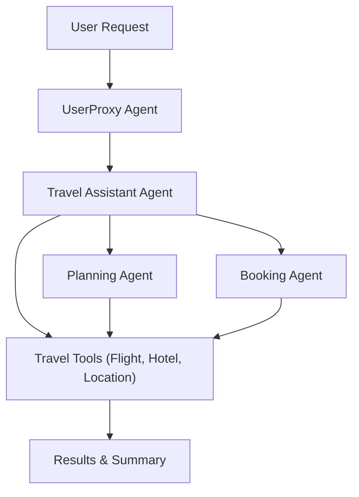

# Agentic Tool Use Pattern: Travel Agent Demo

A Streamlit-based demonstration of the Tool Use Pattern in agentic workflows, where multiple specialized agents (Travel Assistant, Planning Agent, Booking Agent) collaborate and use tools to fulfill complex travel-related user requests. Powered by AutoGen, Ollama, and local LLMs.

---

## Features
- Multi-agent orchestration for travel planning and booking
- Travel Assistant agent coordinates the conversation and tool use
- Planning Agent creates optimal itineraries
- Booking Agent handles booking queries
- Agents use tools for flight status, price tracking, hotel details, and location info
- Interactive Streamlit UI for entering travel requests and viewing agent interactions

---

## Architecture Diagram



---

## Requirements
- Python 3.8+
- [streamlit](https://streamlit.io/)
- [autogen](https://github.com/microsoft/autogen)
- [ollama](https://ollama.com/) (for local LLMs)
- [python-dotenv](https://pypi.org/project/python-dotenv/)

Install dependencies:
```bash
pip install streamlit python-dotenv autogen
```

---

## Usage

1. Ensure Ollama is running locally and supports the required models (e.g., llama3.2).
2. Set your `OPENAI_API_KEY` environment variable (if needed).
3. Run the app:
   ```bash
   streamlit run tool_use_pattern_streamlit.py
   ```
4. Enter a travel-related request (e.g., "I need help planning a trip to New York next week.")
5. View the agent chat history and summary of your travel request.

---

## Notes
- The system demonstrates the Tool Use Pattern for agentic travel planning.
- All agents use the same LLM configuration via Ollama.
- The UI displays each agent's output and the final summary.

---

## License
MIT License
